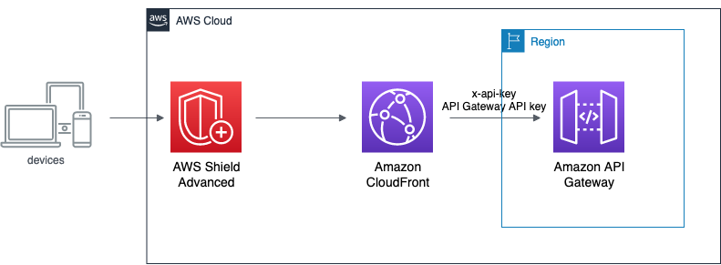
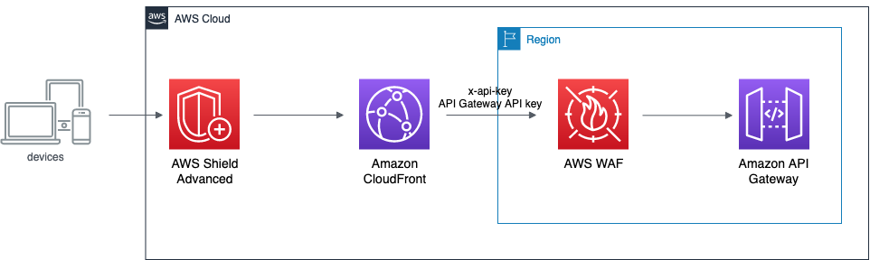
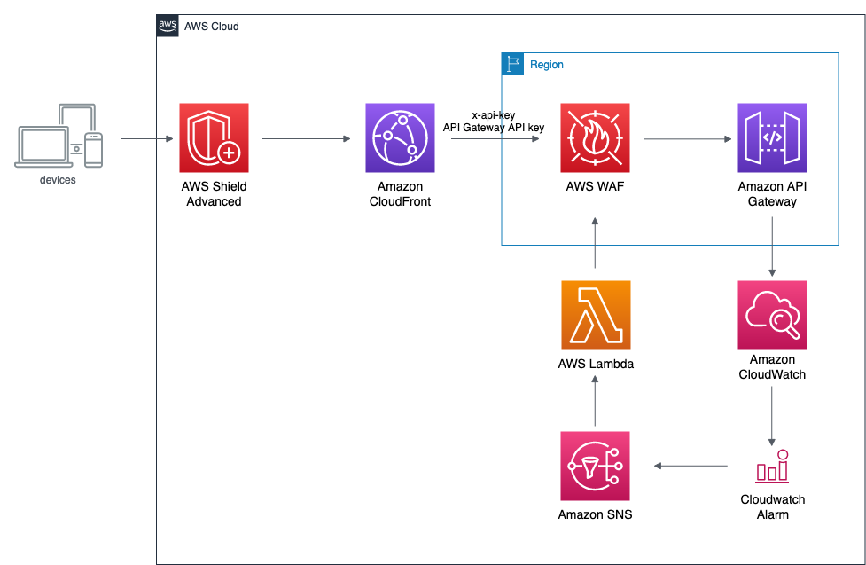
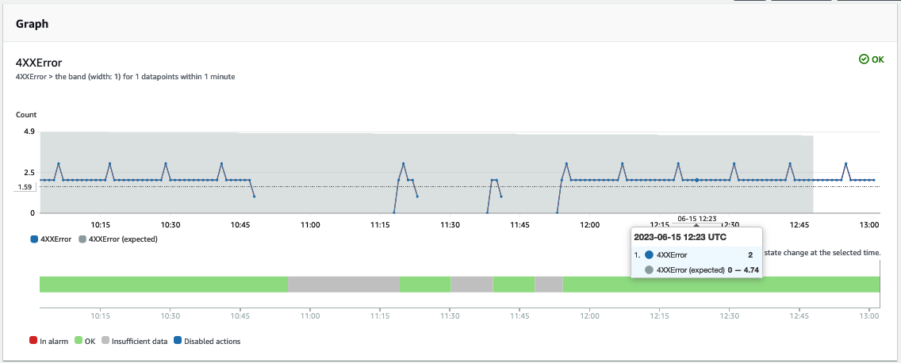
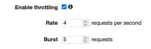
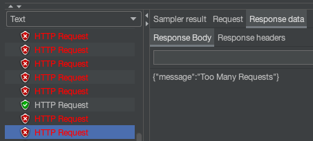
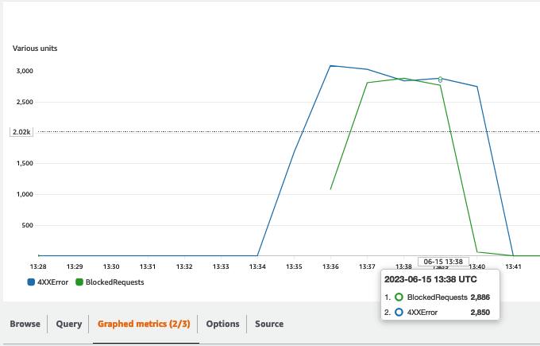
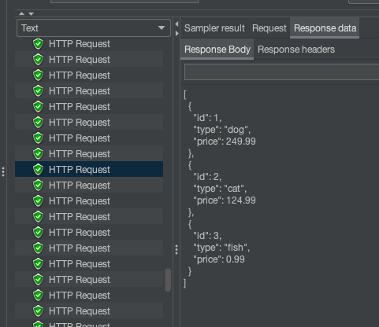
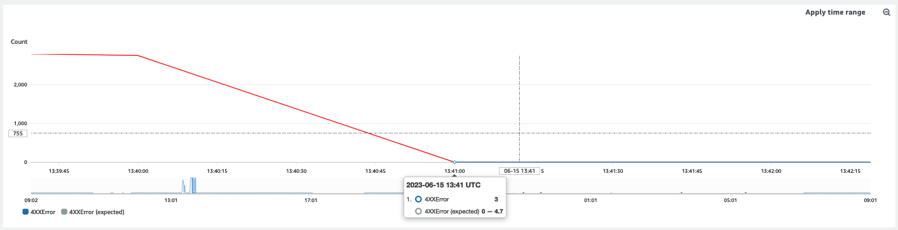
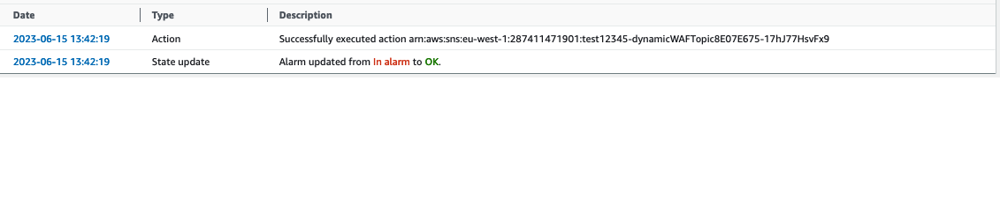

# Dynamically attach a WAF Web ACL to API Gateway

Amazon API Gateway natively protects your application from distributed denial-of-service (DDoS). However, some customers want to add to their applications the increased protection offered by [AWS Shield Advanced](https://docs.aws.amazon.com/whitepapers/latest/security-overview-amazon-api-gateway/security-design-principles.html#mitigate-distributed-denial-of-service-ddos-attack-impacts). Currently AWS Shield Advanced does not support API Gateway, so the recommended approach is to create a CloudFront distribution in front of the API Gateway and designate the distribution as a Shield Advanced protected resource. However, there remains a concern that attackers could attempt to throttle the API Gateway if they know its endpoint URL. To mitigate this risk, it is crucial to ensure that only requests originating from CloudFront are accepted by the API Gateway. This can be achieved by implementing a [secret HTTP header](https://docs.aws.amazon.com/whitepapers/latest/security-overview-amazon-api-gateway/security-design-principles.html#mitigate-distributed-denial-of-service-ddos-attack-impacts) added by CloudFront and validated by a Web Application Firewall (WAF) on API Gateway. This will block any request that does not contain the header before it reaches the API Gateway endpoint.

This configuration, while effective, leads to additional security costs as customers are billed for both the traffic processed by AWS Shield Advanced on CloudFront and the requests processed by the WAF on the API Gateway. This sample shows a possible way to reduce the additional costs by dynamically attaching the WAF rule to the API Gateway when a CloudWatch alarm detects an abnormal amount of 4xx requests on the API Gateway.

## Description

Amazon API Gateway is a popular choice for customers looking to expose their APIs on the internet. Amazon API Gateway natively protects your application from distributed denial-of-service (DDoS) attacks, whether attacked with counterfeit requests (Layer 7) or SYN floods (Layer 3). Some customers want to add to their applications the increased protection offered by [AWS Shield Advanced](https://docs.aws.amazon.com/whitepapers/latest/security-overview-amazon-api-gateway/security-design-principles.html#mitigate-distributed-denial-of-service-ddos-attack-impacts). However Amazon API Gateway is not currently supported by AWS Shield Advanced. In such cases, the recommended best practice is to create an AWS CloudFront distribution using the API Gateway endpoint as the origin. By doing so, you [can protect your CloudFront distribution with AWS Shield Advanced](https://docs.aws.amazon.com/waf/latest/developerguide/ddos-choose-resources.html).

Nevertheless, it's crucial to protect your API Gateway origin from potential attackers who might bypass the CloudFront distribution and attempt to throttle your API by directly invoking the API Gateway endpoint. There are various methods to mitigate this risk, with the most common approach being the [creation of a secret](https://docs.aws.amazon.com/whitepapers/latest/security-overview-amazon-api-gateway/security-design-principles.html#mitigate-distributed-denial-of-service-ddos-attack-impacts) (typically an API key). This secret can then be used in the HTTP request header to validate requests originating from CloudFront. In this scenario, CloudFront is configured to add the header before calling the origin, ensuring that only requests coming from CloudFront are accepted by the API Gateway.

A detailed solution for this can be found [in a blog post](https://aws.amazon.com/blogs/compute/protecting-your-api-using-amazon-api-gateway-and-aws-waf-part-2/) by Chris Munns, which excellently illustrates the process.

<p align="center">

</p>
However, it is important to note that attackers can still make key-less requests to your API Gateway endpoint. These requests will be counted towards your request quota and may lead to legitimate user requests being throttled. To address this issue, you can add a WAF (Web Application Firewall) WEB ACL rule that checks for the presence of a valid API key in the HTTP header. By doing so, the WAF will discard unwanted requests before they reach the API Gateway, effectively protecting your quota limit and ensuring that only requests with a valid API key are processed by the API Gateway.
<p align="center">

</p>

The resulting configuration provides maximum security but comes with additional costs. With this setup, you will be billed for both the traffic processed by AWS Shield Advanced on CloudFront and the requests processed by the WAF on API Gateway.

This sample shows how you could reduce your WAF costs by attaching the WAF WEB ACL rule to your API Gateway endpoint only when abnormal unauthorized traffic is detected.

<p align="center">

</p>


## Requirements

For this sample to work you should have the following prerequisites:
* An AWS Account
* An user or role with permisisons to deploy AWS CloudFormation stacks
* An API Gateway configured. You can create a sample REST API by [following the tutorial](https://docs.aws.amazon.com/apigateway/latest/developerguide/api-gateway-create-api-from-example.html). Note that the API endpoint should be set to "Regional"
* An API Key configured in your API Gateway. You can find details on how to configure one [in the API Gateway documentation](https://docs.aws.amazon.com/apigateway/latest/developerguide/api-gateway-setup-api-key-with-console.html)

## How it works

The solution consists of a Lambda function that attaches and detaches the WAF Rule on the API. The Lambda is triggered by a CloudWatch alarm, which is set off by an anomaly detection model on the  "4xxError" metric emitted by API Gateway. 

The anomaly detection model builds a baseline for your 4xx responses. Is usually better to trigger an alarm looking at anomalies rather than using static threshold, since your API Gateway could emit 4xx reponses as part of its normal operation (e.g. in case of legit failed login attempt by your users). However, a sustained number of requests resulting in 4xx could alter the baseline of the anomaly detection algorithm. If you detect this behavior, you may want to think on switching to a static alarm threshold.


The provided AWS CloudFormation template creates
* A WAF Web ACL rule that checks the value of the 'x-api-key' HTTP header
* An AWS IAM service Role that allows the Lambda function to get the API Key value, to get information from the Web ACL and to attach/detach the WAF rule on API Gateway stage
* An AWS Lambda that updates the API Key value on the Web ACL and attaches or detaches it on the API Gateway stage
* An Amazon Cloudwatch Alarm that looks for anomalies in the 4xxError metric emitted by the API Gateway stage
* An Amazon SNS topic to collect messages pushed by the Amazon CloudWatch alarm
* An Amazon SNS subscription that consumes messages from the topic and triggers the Lambda function
* An Amazon SQS queue to be used as [dead-letter-queue](https://docs.aws.amazon.com/lambda/latest/dg/invocation-async.html#invocation-dlq) for the lambda functions
* An AWS KMS key used to for SNS messages encryption
* [Optional] An Amazon CloudFront ditribution that uses the API Gateway endpoint as origin and sets the "x-api-key" header with the Api Key value

## Installation Instructions

1. Download the AWS CloudFormation template `dynamic_waf_api_gw.json` to your machine or upload it to an S3 bucket
2. Access to your AWS account and switch to the region in which you want to apply the sample
3. Navigate to AWS CloudFormation console and select Stacks>Create Stack with new Resources. Alternatively, you may follow this url: https://console.aws.amazon.com/cloudformation/home#/stacks/create
4. Select "Template is ready" and "Upload a template file". Choose the file that you previusly downloaded and click "Next"
5. Enter a name for the stack, for example "dynamic-waf-api-gw"
6. Fill in the parameters and then click "Next. All parameters are required
    * *apiGwArn* is the ARN of the API Gateway you want to protect e.g. arn:aws:apigateway:{region}:{account-id}:/restapis/{api-id}/stages/{stage-id}
    * *apiKeyID* is the API Key ID that is active on the API Gateway stage you would like to protect e.g. 'abcde12345'
    * *apiName* is the name of the API Gateway you want to protect e.g. 'PetStore'
    * *wafMode* is the Web ACL mode; default is Count. IMPORTANT: It is a good practice to initally deploy the rule as 'Count' and deploy as 'Block' after successful testing. To deploy as block you can update the existing CloudFormation Stack using the same template changing the parameter
    * *deployDistribution* if set to True, deploy a sample CloudFront Distribution that uses the API Gateway as origin and adds the API Key as custom header
7. Accept all defaults in next screen clicking Next
8. Review your configuration and then tick the checkbox "I acknowledge that AWS CloudFormation might create IAM resources" before clicking Submit

## Testing it

> **_NOTE:_** the sh scripts make use of curl to generate traffic towards the http endpoint. Make sure to have it installed in your machine

After deploying the CloudFormation template you will need to generate some requests for your API so that the CloudWatch anomaly detection model can build a baseline. You can use the provided script [load_apigw.sh](./scripts/load_apigw.sh) that makes requests to your CloudFront endpoint e.g.
```
./load_apigw.sh https://apiID123.execute-api.eu-west-1.amazonaws.com/stage/pets https://ditrId12345.cloudfront.net/stage/pets
```
Every 20 requests to CloudFront, it also makes a request to the API Gateway endpoint, that fails as it does not have the required x-api-key header. For a newly created API it usually requires 5-6 hours to generate enough metric for the anomaly detection algorithm to build a baseline.

After generating the baseline you can use the provided script [4xxspike.sh](./scripts/4xxspike.sh) to simulate an attack to your API Gateway endpoint e.g.
```
./4xxspike.sh https://apiID123.execute-api.eu-west-1.amazonaws.com/stage/pets
```
 The script performs 500 requests in ~1 minute which should be sufficient to create an anomaly and trigger the alarm. Alternatevely, you can use the JMeter script [waf-test.jmx](./scripts/waf-test.jmx) which makes 600 unauthorized requests and 90  authorized request in ~90 seconds. You can get Apache JMeter from the release page [on the project website][def]

 ## Test Results

 The CloudWatch Anomay Detection baseline will be avaialbile as soon as the CloudWatch alarm collects enough metric from the API Gateway endpoint. In my example the Anomaly Detection algorithm defined an expected 4xxError baseline between 0 and 4.74 requests per minute.

 <p align="center">

</p>

Now let's create an anomaly. I'll throttle my API Gateway by making requests to the endpoint without proving the api-key secret in header. My API Gteway stage is on purpose set on a very low [throttling limit](https://docs.aws.amazon.com/apigateway/latest/developerguide/api-gateway-request-throttling.html) of 4 request/second, with a bucket of 5 requests. 

 <p align="center">

</p>

For this purpose I'll use JMeter. The provided JMeter script sends requests to the CloudFront endpoint at a very slow rate ~1request/second and in parallel sends ~8requests/second to the API Gateway endpoint without providing the secret key. Let's launch the test and see what happens. 

 <p align="center">

</p>

The throttling limit is exceeded and API Gateway is now serving 429 - too many requests error through CloudFront back to my client. However, in few minutes the alarm triggers the Web ACL Rule.

 <p align="center">

</p>


 <p align="center">

</p>

The WAF starts to block the requests before they reach the API Gateway endpoint and my API Gateway starts to send back again data to the client.


<p align="center">

</p>

<p align="center">

</p>

After the request spike, the alarm state goes back to OK and the the Web ACL is automatically detached by the automation.

<p align="center">

</p>

<p align="center">

</p>


## Notes

* Having the WAF rule attached to the API Gateway at all time is the most secure option. Detecting the anomaly and triggering the WAF rule attachment to API Gateway has a delay of some minutes, in which the API may become unavailable.
* Rotating security keys is a best practice. You can find details on how to implement an automatic key rotation approach [in this blog post](https://aws.amazon.com/blogs/compute/protecting-your-api-using-amazon-api-gateway-and-aws-waf-part-2/) by Chris Munns.
* The Lambda function updates the API key value in the WAF rule every time it is invoked. So you don't need to keep the API key value aligned when rotating it.

[def]: https://jmeter.apache.org/download_jmeter.cgi